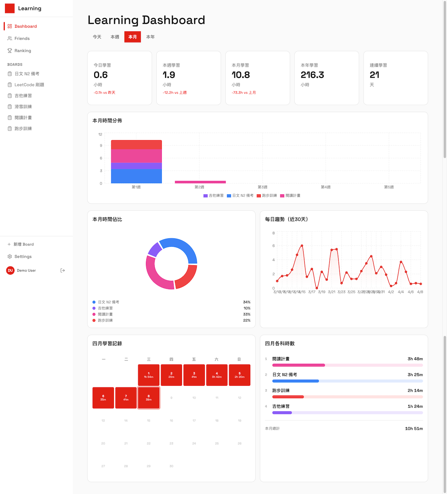

# Learning Dashboard

[繁體中文](./README.zh-TW.md)



Learning Dashboard is a personal growth platform focused on making learning effort visible.  
It combines boards, time tracking, analytics, and social features so learners can turn daily effort into a measurable growth record.

## Current Scope

The project currently includes:

- Learning boards with both `TASK_BASED` and `TIME_ONLY` modes
- Task management with lists, cards, drag-and-drop reordering, and column sorting
- Time tracking through a timer and manual entries
- Analytics dashboards with summary cards, daily trends, monthly heatmaps, and board breakdowns
- Social features including friend invites, friend lists, and pending requests
- Leaderboards based on study time and streaks
- Friend stats pages for comparing weekly progress and board distribution
- Web Push notification subscription management
- PWA basics including `manifest.json`, `sw.js`, and app icons
- Multiple sign-in methods: Google, GitHub, and credentials

## Tech Stack

- Framework: Next.js 15 App Router + React 19 + TypeScript
- API: tRPC
- Database: PostgreSQL + Prisma ORM
- Auth: NextAuth.js
- UI: Tailwind CSS + Base UI + custom components
- Drag and Drop: `@dnd-kit`
- Charts: Recharts
- Forms and Validation: React Hook Form + Zod
- Notifications: Web Push
- Testing: Vitest + Playwright
- Deployment: Docker + Google Cloud Build + Cloud Run

## Main Routes

- `/dashboard`: personal learning dashboard
- `/board/[boardId]`: board detail view for task-based and time-only boards
- `/timer`: task timer and manual time entry
- `/friends`: friend list and invite management
- `/friends/[userId]`: friend learning stats
- `/ranking`: friend leaderboard
- `/settings`: profile and notification settings
- `/invite/[token]`: friend invite acceptance page

## Getting Started

### 1. Install dependencies

```bash
pnpm install
```

### 2. Configure environment variables

Copy `.env.example` to `.env`, then fill in the values you need:

```env
DATABASE_URL=postgresql://postgres:@localhost:5432/learning-dashboard

NEXTAUTH_SECRET=your-secret
NEXTAUTH_URL=http://localhost:3000
NEXT_PUBLIC_SITE_URL=http://localhost:3000

GOOGLE_CLIENT_ID=
GOOGLE_CLIENT_SECRET=
GITHUB_CLIENT_ID=
GITHUB_CLIENT_SECRET=

VAPID_PUBLIC_KEY=
VAPID_PRIVATE_KEY=
VAPID_EMAIL=
NEXT_PUBLIC_VAPID_PUBLIC_KEY=

CRON_SECRET=
```

Notes:

- `NEXT_PUBLIC_SITE_URL` is used for `metadataBase`, social sharing images, and other metadata that require absolute URLs
- `NEXTAUTH_URL` is the base URL used by NextAuth callbacks
- Push notification variables are only required when enabling Web Push

### 3. Initialize the database

```bash
pnpm migrate-dev
pnpm db-seed
```

### 4. Start the development server

```bash
pnpm dev
```

If you want migrations and seed data to run together with development startup, you can also use:

```bash
pnpm dx
```

Open [http://localhost:3000](http://localhost:3000)

## Common Commands

| Command | Description |
| --- | --- |
| `pnpm dev` | Start the Next.js development server |
| `pnpm dx` | Run migrations, seed, and dev together |
| `pnpm build` | Create a production build |
| `pnpm start` | Start the production server |
| `pnpm lint` | Run ESLint |
| `pnpm typecheck` | Run TypeScript checks |
| `pnpm test-unit` | Run Vitest |
| `pnpm test-e2e` | Run Playwright |
| `pnpm migrate-dev` | Run Prisma development migrations |
| `pnpm migrate` | Apply production migrations |
| `pnpm db-seed` | Seed the database |
| `pnpm prisma-studio` | Open Prisma Studio |

## Data Model Overview

Core models include:

- `User`: users, auth data, timezone, and push devices
- `Board`: learning boards in task-based or time-only mode
- `List`: board columns
- `Task`: task cards
- `TimeEntry`: time tracking records
- `Friendship`: friend relationships and pending requests
- `FriendInvite`: invite tokens
- `PushSubscription`: Web Push subscription records

The Prisma schema lives at [prisma/schema.prisma](/Users/yenyu/Desktop/coding-learning/learning-dashboard/prisma/schema.prisma).

## Project Structure

```text
src/
  app/
    (app)/          authenticated application pages
    (auth)/         login and registration flows
    invite/         friend invite acceptance page
  components/
    board/          board and drag-and-drop UI
    dashboard/      analytics and charts
    friends/        friends and invite UI
    ranking/        leaderboard UI
    settings/       profile and notification settings
    ui/             shared UI primitives
  server/
    routers/        tRPC routers
    auth.ts         NextAuth configuration
  hooks/
  lib/
prisma/
public/
```

## Deployment

The app is containerized with Docker and deployed to Cloud Run through Google Cloud Build.

Relevant files:

- [Dockerfile](/Users/yenyu/Desktop/coding-learning/learning-dashboard/Dockerfile)
- [cloudbuild.yaml](/Users/yenyu/Desktop/coding-learning/learning-dashboard/cloudbuild.yaml)

Make sure these variables are available during deployment:

- `NEXT_PUBLIC_SITE_URL`
- `NEXT_PUBLIC_VAPID_PUBLIC_KEY`
- `NEXTAUTH_URL`
- `DATABASE_URL`
- `NEXTAUTH_SECRET`

`NEXT_PUBLIC_SITE_URL` needs to exist at build time because it is used in Next.js metadata generation.

## Notes

- The root route `/` currently redirects to `/dashboard`
- The project uses `output: 'standalone'`, which is well suited for container deployment
- `src/server/env.ts` validates required environment variables outside the build phase
